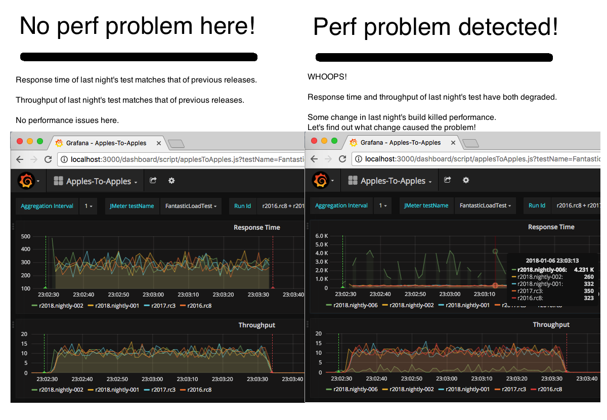

# applesToApples



# Installation Overview

1. Install Docker and launch this Grafana/InfluxDB solution:  https://github.com/eostermueller/grafanaInfluxDockerCompose
2. Install [JMeter 3.2 or later](jmeter.apache.org) and [the JMeter-plugins Plugin Manager](https://jmeter-plugins.org/wiki/PluginsManager/). 
3. Add this plugin jar file to JMETER_HOME/lib/ext: https://github.com/eostermueller/JMeter-InfluxDB-Writer/releases/tag/v-1.2x
4. Copy [this file](https://raw.githubusercontent.com/eostermueller/applesToApples/master/applesToApples.js) into the 'dashboards' folder of step 1.

5. Restart JMeter after the step 2 changes and download [this JMeter plan file to your desktop](https://raw.githubusercontent.com/eostermueller/applesToApples/master/applesToApples.jmx) on the same machine used for step 1.  Run this load test for a few minutes.
6. From the machine used in step 1, open this link in your browser to see the grafana dashboard.  Login with admin/admin.
    ```
    http://localhost:3000/dashboard/script/applesToApples.js?testName=FantasticLoadTest
    ```

